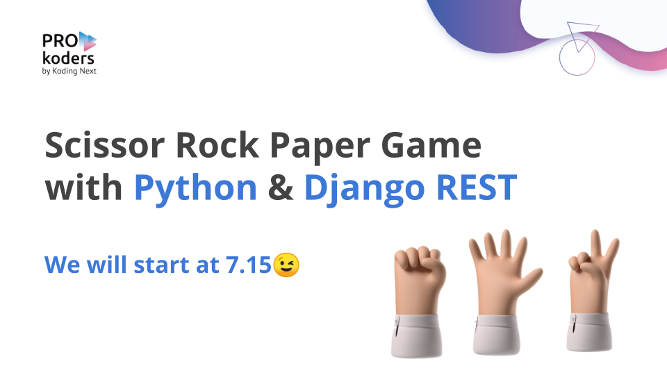

## SRP Game Python Django 



SRP (Scissor, Rock and Paper) Game build with Django, Django Rest Framework. Implemented
with HTML, CSS and JavaScript as a Frontend Application.

### Quick Start

Clone this project, enter directory `srp-game`. Then, run the 
following command to install dependency packages:

```
$ pip install -r requirements.txt
```

> Recommended using virtual environment!

Next, run the development server:

```
$ python manage.py runserver
```

After run, enter `srp-fe` directory, and run:

```
$ cd srp-fe
$ python -m http.server 5000
```

Open http://localhost:5000 in your browser and try it.


